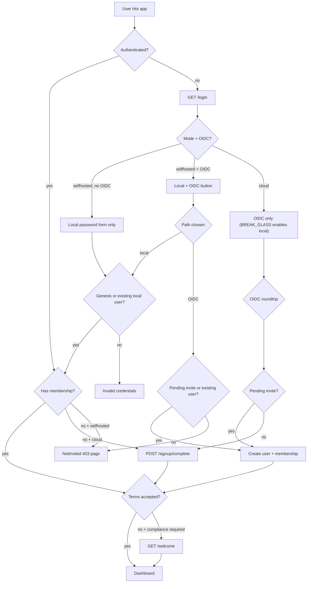

# Multitenancy

How yasaku isolates tenants and routes sign-ins. Read in five minutes.

## Modes

|                         | `selfhosted`            | `cloud`                                             |
| ----------------------- | ----------------------- | --------------------------------------------------- |
| DB driver               | `sqlite` or `postgres`  | `postgres` only (enforced)                          |
| OIDC                    | optional                | required (enforced)                                 |
| Local `/login` password | on by default           | off; `YASAKU_GENESIS_BREAK_GLASS=true` to re-enable |
| Org creation from UI    | disabled                | enabled                                             |
| Public OIDC signup      | disabled (invite-only)  | enabled                                             |
| Invites                 | require OIDC configured | always available                                    |

## Data isolation — how tenants stay separated

- Every tenant-scoped table carries `org_id UUID NOT NULL`.
- Postgres has **row-level security** enabled + FORCED on those tables. Policy: `USING (org_id = current_setting('app.current_org_id')::uuid)`.
- Every store call opens a `*sql.Tx`, runs `SELECT set_config('app.current_org_id', <org>, true)` — `is_local=true` scopes it to that tx.
- The list of tenant tables is **codegen'd** from RLS migrations — see `schema/tenant_tables_gen.go`. Run `make tenant-tables` after adding a new RLS-enabled table.
- SQLite: no RLS. Isolation relies entirely on Go-side `tenant.Context` threading + `WHERE org_id = ?` in queries.

## Three connection tiers (Postgres, production)

| Role              | Purpose                                       | BYPASSRLS |
| ----------------- | --------------------------------------------- | --------- |
| `yasaku_owner`    | Owns objects (tables, indices)                | no        |
| `yasaku_migrator` | Runs migrations under `SET ROLE yasaku_owner` | no        |
| `yasaku_service`  | Runtime connection                            | no        |

Provision via `scripts/db/provision.sh` (`APP=yasaku DB_NAME=yasaku`). Point `YASAKU_DB_MIGRATOR_DSN` at `yasaku_migrator` (`YASAKU_DB_MIGRATOR_ROLE=yasaku_owner`) and `YASAKU_DB_DSN` at `yasaku_service`. Boot uses migrator briefly for migrations, closes it, then serves from service.

## Reader / writer

- `db.Pool{W, R}` — writer + optional reader (falls back to W when no separate replica).
- SQLite: R always aliases W.
- Non-tenant reads (`user`, `onboard`) use `pool.R`.
- Tenant-scoped reads currently use `pool.W` (needs `set_config` in a tx). Read replicas for tenant tables is a follow-up.

## Unit of Work

- `db.RunInTx(ctx, pool, fn)` — plain tx.
- `tenant.RunInTx(ctx, pc, tc, fn)` — tenant-scoped tx (calls `set_config` for the org).
- Both put the `*sql.Tx` in `ctx` via `db.ContextWithTx`.
- Stores call `db.CurrentTx(ctx)` — if present, enroll in the outer tx; otherwise start their own.
- Nested UoW is refused with `db.ErrNestedUnitOfWork`.

## Sign-in decision tree

## Invitations

- Sent by an owner/admin via `POST /orgs/{slug}/invites` — stores hash of a one-time token, emails the link.
- **Selfhosted + no OIDC**: invite creation is blocked with `InvitesDisabledError` (409). The `/orgs/{slug}/invites` page shows a warning banner and hides the form. Rationale: an invited user has no way to authenticate without either OIDC or a local password.
- **Invite acceptance URL**: `GET /invites/accept?token=…`
  - Not signed in → token cookied, redirect to `/login`.
  - Signed in → matches email against token, creates membership, forwards to `/welcome` if terms not yet accepted, else to the org.

## Terms of Service gate

- Enabled via `YASAKU_COMPLIANCE_REQUIRE_ACCEPTANCE=true`.
- Links: `YASAKU_COMPLIANCE_TERMS_URL`, `YASAKU_COMPLIANCE_PRIVACY_URL`.
- Middleware `WelcomeGate` redirects any authenticated user with `TermsAcceptedAt=zero` to `/welcome`.
- `/welcome` renders the T&C checkbox + optional display-name fixup → stamps `users.terms_accepted_at` → back to `return_to`.
- Genesis admins auto-accept at bootstrap (they set the env, they consented).

## Adding a new tenant-scoped resource

1. Write migration in `schema/migrations/postgres/NNN_<name>.sql`:
   - `CREATE TABLE {{.Schema}}.{{.TablePrefix}}<name> ( … org_id UUID NOT NULL REFERENCES … );`
   - `ALTER TABLE {{.Schema}}.{{.TablePrefix}}<name> ENABLE ROW LEVEL SECURITY;`
   - `ALTER TABLE {{.Schema}}.{{.TablePrefix}}<name> FORCE ROW LEVEL SECURITY;`
   - `CREATE POLICY {{.TablePrefix}}<name>_tenant ON {{.Schema}}.{{.TablePrefix}}<name> USING (org_id = {{.Schema}}.{{.TablePrefix}}current_org_id());`
   - Call the helper — never inline `current_setting(...)::uuid`. `schema` guards this with a test.
2. Mirror in `schema/migrations/sqlite/NNN_<name>.sql` (no RLS).
3. Bump `schema/migrations/postgres/VERSION` and `schema/migrations/sqlite/VERSION`.
4. `make tenant-tables` — regenerates `schema/tenant_tables_gen.go`.
5. Implement the store — `internal/<name>/{postgres.go, pgreader.go, pgwriter.go, sqlite.go}`. Copy any existing tenant-scoped module as a template.
6. Register in `internal/boot/server.go`.

## Common pitfalls

- **Inlining `current_setting('app.current_org_id')::uuid` in a policy** → a transaction-local `set_config` resets to `''`, not NULL, when the transaction ends, so any pooled connection that once served a tenant makes `''::uuid` raise `22P02` on every later cross-tenant read. Use `{{.Schema}}.{{.TablePrefix}}current_org_id()`, which wraps it in `NULLIF`.
- **Reading a tenant table before a tenant exists** — invite-by-token, invite-by-email, org-by-slug. RLS hides every row, so the query returns empty rather than failing. Add a `SECURITY DEFINER` wrapper in `005_definer_functions.sql` and read through it.

- **Forgetting `set_config` in a tx** → RLS blocks all rows for `yasaku_service`. Symptom: empty result sets in prod, works in dev under superuser. Fix: use `tenant.PgConn.BeginTenanted` (stores already do).
- **Cross-tenant leak in a service method** — a service that accepts `orgID` as a parameter but doesn't compare against `tenant.From(ctx).OrgID`. Always use the org from ctx as source of truth; parameters are for scoping within the same tenant only.
- **Silent user-row leak on rejected OIDC signup (selfhosted)** — fixed via `AllowSignupFn` pre-persistence check. If you add a new sign-in path, gate it the same way.

## Related docs

- [`docs/PLATFORM_TEMPLATE.md`](PLATFORM_TEMPLATE.md) — kernel + supervisor shape.
- [`docs/MODULE_TEMPLATE.md`](MODULE_TEMPLATE.md) — domain module layout.
- [`docs/CLI_CONTRACT.md`](CLI_CONTRACT.md) — CLI surface.
- [`README.md`](../README.md#modes) — mode summary + first-boot behavior.
