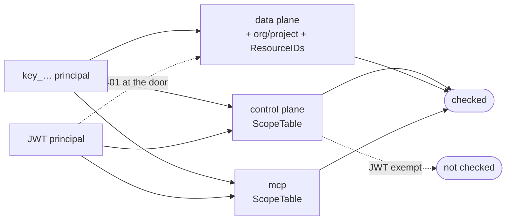

# Scopes

Wire contract. Keys store these exact strings; integrators type them; MCP hosts read them from
the metadata document. **Additive only** — renaming one invalidates keys in the field.

Defined in `internal/platform/authn/scope.go`, one `catalog` row per scope with its level.
`authn.Mintable()` gates minting; `authn.Valid()` still accepts a retired scope on an existing key.

## Catalog

| Scope           | Level   | Grants                                 |
| --------------- | ------- | -------------------------------------- |
| `posts:read`    | project | Read posts and todos; list projects    |
| `posts:write`   | project | Create, update, publish, unpublish     |
| `posts:admin`   | project | Delete a post or todo                  |
| `apikeys:read`  | project | List keys; `Whoami`                    |
| `apikeys:write` | project | **Retired.** Validates, grants nothing |
| `members:read`  | org     | List the org's members (`member_list`) |

- **Levels.** A `project` scope acts on data inside the projects a key reaches. An `org` scope acts
  on the org itself. A project key refuses an org scope (`APK003`); an org key may hold one; a
  personal token may hold one only while its owner is an owner or admin, checked on every request.
- **Who manages keys.** Org and project keys: an owner or admin person (`org.Service.RequireManager`),
  on every surface. A personal token: its owner, a member of its org. A key never manages keys.
- **Every new key expires** within `apikey.MaxLifetime` (a year).
- **No implication.** `posts:admin` does not grant `posts:write`. The check is
  `slices.Contains`. A key needing read + delete holds both strings.
- **`posts:*` spans `blog` and `todo`.** A fork splitting them adds its own strings.
- **`project_list` rides on `posts:read`** rather than a `projects:read` of its own. A new scope
  string obliges every operator to extend an external authorization server's catalog and re-attach
  the client before project discovery works at all.

## Enforcement

| Surface       | Enforced by                             | Applies to               |
| ------------- | --------------------------------------- | ------------------------ |
| control plane | `authn.Interceptor` + `ScopeTable()`    | keys only — JWT exempt   |
| data plane    | `apikey.Authorize` per route            | keys only — JWT gets 401 |
| mcp           | `mcp.Server.authorize` + `ScopeTable()` | **everyone, JWT too**    |
| console       | session membership and role             | —                        |

Two asymmetries, both deliberate:

- **Control plane exempts a JWT** — a signed-in human carries their own authority. A procedure
  missing from the table is **denied**, not admitted; `TestEveryRPCHasAScope` pins it.
- **MCP exempts nobody** — an MCP token is a delegated grant an agent holds for a person, so
  its scopes are the limit of that delegation. See [`mcp`](../mcp/README.md).

Every surface narrows past the scope with one rule, `session.Principal.Reaches*`: a key reaches
only the projects it was granted — one for a project key, the grant for an org key or personal
token — and a non-empty `ResourceIDs` confines it to named resources.

## Adding one

A new string starts in two places, both of them here:

1. Constant + `catalog` entry, with its level, in `internal/platform/authn/scope.go`.
2. A row in the catalog above.

Mapping it onto a surface is that surface's own procedure:
[`howto/internal-api.md`](../howto/internal-api.md) for `internal/controlplane/scopes.go`,
[`howto/external-api.md`](../howto/external-api.md) for the `authorize` calls in
`internal/dataplane/`, [`howto/mcp-tool.md`](../howto/mcp-tool.md) for `internal/mcp/scopes.go`.

Never remove a scope — mark it `retired` instead. Keys holding it keep validating and it is never
minted again.
