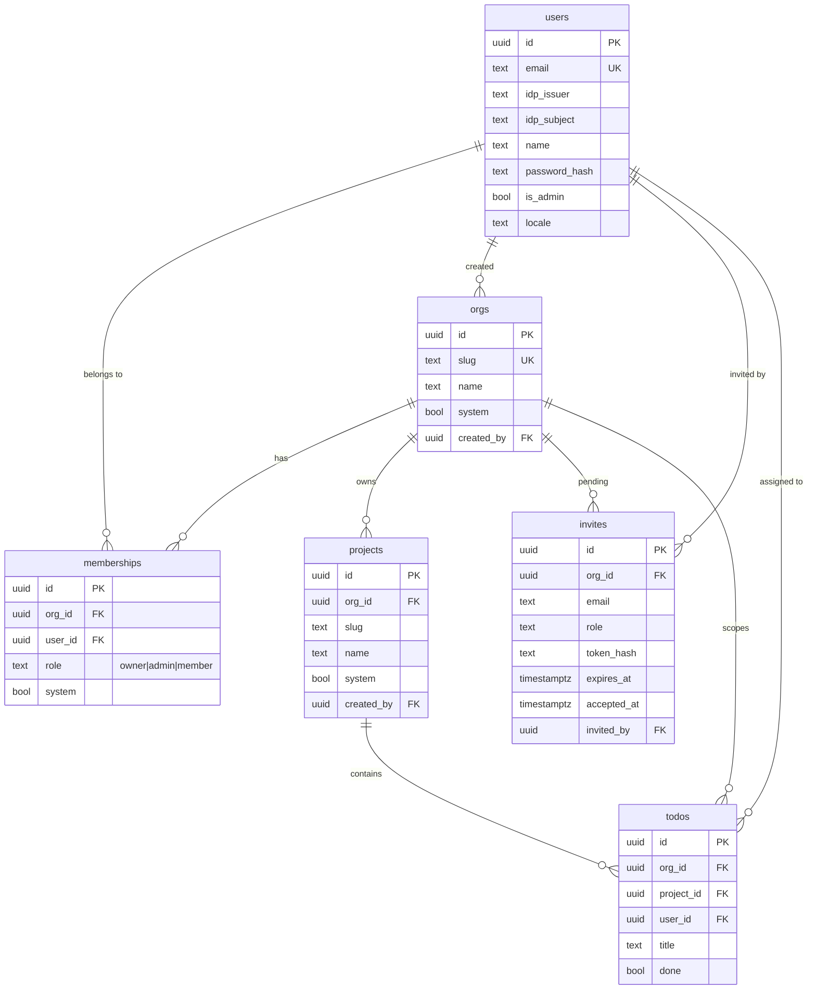

# schema

Embedded goose migrations for Postgres and SQLite, the runtime migrator, the
RLS boot-time guard, and the tenant-table registry consumed by `tenant.PgConn`.

Migrations are `.sql` templates rendered with `{{.Schema}}`, `{{.TablePrefix}}`,
and `{{.Role}}` before goose applies them. Both dialects satisfy the same
domain interfaces — SQLite is dev/demo, Postgres is production.

## Layout

```
schema/
├── migrations/postgres/    # 001_init, 002_rls, 003_bootstrap, VERSION
├── migrations/sqlite/      # 001_init, 002_bootstrap, VERSION
├── migrator.go             # goose runner, template rendering, embed FS
├── migrator_templatefs.go  # per-boot template-rendered file system
├── rls_guard.go            # boot-time BYPASSRLS assertion
└── tenant_tables_gen.go    # generated from RLS migrations (make tenant-tables)
```

`TenantTableSuffixes` (in `tenant_tables_gen.go`) drives RLS policy
enforcement — every table in this list carries `org_id` and gets
`FORCE ROW LEVEL SECURITY` on Postgres. Regenerate with
`make tenant-tables` after adding a tenant-scoped table.

## Tables



`users` is global (no `org_id`); everything else is tenant-scoped and
appears in `TenantTableSuffixes`.

## Adding a migration

1. Add `NNN_<name>.sql` under both `migrations/postgres/` and
   `migrations/sqlite/`. Use goose `-- +goose Up` / `-- +goose Down`
   markers and `{{.Schema}}` / `{{.TablePrefix}}` template variables.
2. Bump `VERSION` in the affected dialect(s) to the highest `NNN` present.
3. If the new table carries `org_id`, add its RLS policy in the Postgres
   migration and run `make tenant-tables` to regenerate the registry.
4. If the migration must run as owner (DDL), prefix the block with
   `{{if .Role}}SET ROLE {{.Role}};{{end}}`.
