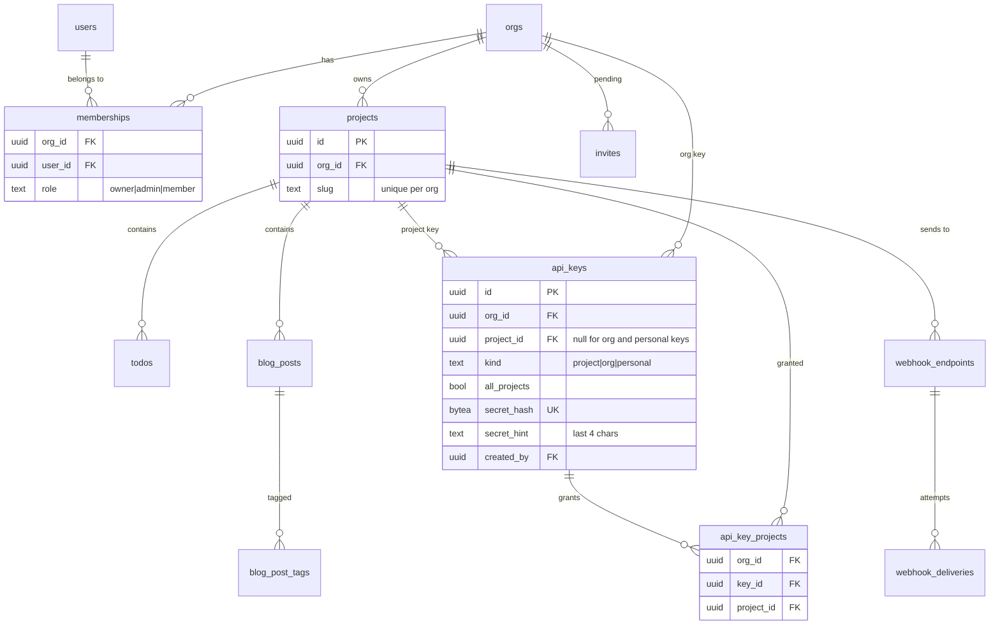
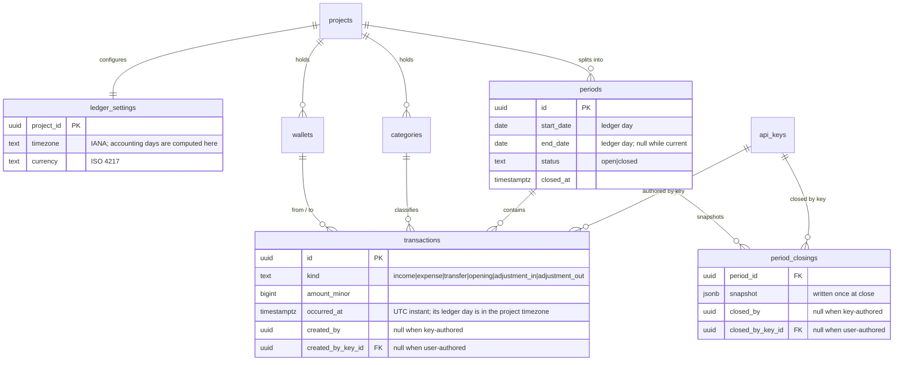

# schema

Embedded goose migrations for Postgres and SQLite, the runtime migrator, the
RLS boot-time guard, and the tenant-table registry consumed by `tenant.PgConn`.

Migrations are `.sql` templates rendered with `{{.Schema}}`, `{{.TablePrefix}}`,
and `{{.Role}}` before goose applies them. Both dialects satisfy the same
domain interfaces — SQLite is dev/demo, Postgres is production.

## Layout

```
schema/
├── migrations/postgres/    # 001_init … 016_key_authorship, VERSION
├── migrations/sqlite/      # 001_init … 013_key_authorship, VERSION
├── migrator.go             # goose runner, template rendering, embed FS
├── migrator_templatefs.go  # per-boot template-rendered file system
├── rls_guard.go            # boot-time BYPASSRLS assertion
├── table_guard.go          # boot-time check for tables with no org_id
└── tenant_tables_gen.go    # generated from RLS migrations (make tenant-tables)
```

The two dialects number independently — SQLite has no RLS or definer
migrations — so each `VERSION` pins its own highest `NNN`.

`TenantTableSuffixes` (in `tenant_tables_gen.go`) drives RLS policy
enforcement — every table in this list carries `org_id` and gets
`FORCE ROW LEVEL SECURITY` on Postgres. Regenerate with
`make tenant-tables` after adding a tenant-scoped table.

## Tables

`users` and `sessions` are global (no `org_id`); every other table is
tenant-scoped and appears in `TenantTableSuffixes`.


```mermaid
erDiagram
    users ||--o{ memberships : "belongs to"
    orgs ||--o{ memberships : "has"
    orgs ||--o{ projects : "owns"
    orgs ||--o{ invites : "pending"
    projects ||--o{ todos : "contains"
    projects ||--o{ blog_posts : "contains"
    blog_posts ||--o{ blog_post_tags : "tagged"
    projects ||--o{ api_keys : "project key"
    orgs ||--o{ api_keys : "org key"
    api_keys ||--o{ api_key_projects : "grants"
    projects ||--o{ api_key_projects : "granted"
    projects ||--o{ webhook_endpoints : "sends to"
    webhook_endpoints ||--o{ webhook_deliveries : "attempts"

    memberships {
        uuid org_id FK
        uuid user_id FK
        text role "owner|admin|member"
    }
    projects {
        uuid id PK
        uuid org_id FK
        text slug "unique per org"
    }
    api_keys {
        uuid id PK
        uuid org_id FK
        uuid project_id FK "null for org and personal keys"
        text kind "project|org|personal"
        bool all_projects
        bytea secret_hash UK
        text secret_hint "last 4 chars"
        uuid created_by FK
    }
    api_key_projects {
        uuid org_id FK
        uuid key_id FK
        uuid project_id FK
    }
```

Also tenant-scoped: `blog_categories`, `blog_tags`, `outbox_entries`, `bootstrap`.

## API keys

- **Three kinds, one table.** A `project` key has a `project_id` for life. An
  `org` key and a `personal` token have none and reach either every project
  (`all_projects`) or the rows in `api_key_projects`; a personal token's
  `created_by` is its owner. `api_keys_kind_shape` refuses any other mix.
- **A grant row cannot cross orgs.** Both foreign keys on `api_key_projects`
  are composite, `(org_id, key_id)` and `(org_id, project_id)`. RLS only
  checks the row's own `org_id`, and SQLite has no RLS at all.
- **Grants only widen.** The domain has no verb that removes a project; moving to
  all projects deletes the named rows in the same write.
- **New keys expire within a year** (`apikey.MaxLifetime`). `expires_at` may be
  null on existing rows.

## SECURITY DEFINER functions (Postgres)

Each one lifts RLS for a lookup that runs before any tenant scope exists.
All are owned by the migration role, with `EXECUTE` revoked from `PUBLIC`,
pinned by `TestMigrateUp_DefinerFunctionsAreOwnedByTheMigrationRole`.

| Function                                | Resolves                                |
| --------------------------------------- | --------------------------------------- |
| `resolve_api_key_by_secret_hash(bytea)` | a key and its project grant, by hash    |
| `resolve_org_by_slug(text)`             | an org from a path slug                 |
| `resolve_invite_by_token_hash(text)`    | an invite from its link                 |
| `list_pending_invites_for_email(text)`  | invites waiting for a signing-up user   |
| `list_orgs_for_user(uuid)`              | a user's orgs, to resolve their tenant  |
| `list_org_ids()`                        | every org id, for cross-tenant jobs     |
| `resolve_system_org()`                  | the singleton org on a selfhosted login |

## Adding a migration

1. Add `NNN_<name>.sql` under `migrations/postgres/` and
   `migrations/sqlite/`, each at its own next number. Use goose
   `-- +goose Up` / `-- +goose Down` markers and `{{.Schema}}` /
   `{{.TablePrefix}}` template variables.
2. Bump `VERSION` in each dialect to its highest `NNN`.
3. If the new table carries `org_id`, add its RLS policy in the Postgres
   migration and run `make tenant-tables` to regenerate the registry.
4. A join table between tenant rows takes composite `(org_id, …)` foreign
   keys, so a row cannot pair one org's parent with another org's child.
5. If the migration must run as owner (DDL), prefix the block with
   `{{if .Role}}SET ROLE {{.Role}};{{end}}`.
6. SQLite cannot alter a column, so a change there rebuilds the table
   (`<t>_new`, copy, drop, rename). **Dropping the old table fires every
   child's `ON DELETE` action**. Save and restore those links, as
   `012_org_api_keys.sql` does for `todos.created_by_key_id`, and cover it
   with a migration test that runs with `foreign_keys(1)`.

## yasaku

### Numbering

yasaku keeps one numbering per dialect. Its own migrations (`007_yasaku`,
`016_key_authorship` on Postgres; `005_yasaku`, `013_key_authorship` on
SQLite) interleave with the template's. A template migration lands at yasaku's
next free number with byte-identical content, so template `007_apikey` is
yasaku `008_apikey`. Never renumber or edit an applied migration. Production has
applied everything up to the version it ran.

### Ledger tables

All are tenant-scoped (in `TenantTableSuffixes`) and carry `org_id` plus `project_id`.
Cross-table links are composite `(id, org_id)` foreign keys, so a row cannot
name another org's wallet, category or period.


```mermaid
erDiagram
    projects ||--|| ledger_settings : "configures"
    projects ||--o{ wallets : "holds"
    projects ||--o{ categories : "holds"
    projects ||--o{ periods : "splits into"
    periods ||--o{ period_closings : "snapshots"
    wallets ||--o{ transactions : "from / to"
    categories ||--o{ transactions : "classifies"
    periods ||--o{ transactions : "contains"
    api_keys ||--o{ transactions : "authored by key"
    api_keys ||--o{ period_closings : "closed by key"

    ledger_settings {
        uuid project_id PK
        text timezone "IANA; accounting days are computed here"
        text currency "ISO 4217"
    }
    periods {
        uuid id PK
        date start_date "ledger day"
        date end_date "ledger day; null while current"
        text status "open|closed"
        timestamptz closed_at
    }
    transactions {
        uuid id PK
        text kind "income|expense|transfer|opening|adjustment_in|adjustment_out"
        bigint amount_minor
        timestamptz occurred_at "UTC instant; its ledger day is in the project timezone"
        uuid created_by "null when key-authored"
        uuid created_by_key_id FK "null when user-authored"
    }
    period_closings {
        uuid period_id FK
        jsonb snapshot "written once at close"
        uuid closed_by "null when key-authored"
        uuid closed_by_key_id FK "null when user-authored"
    }
```

- **Time.** Instants are `TIMESTAMPTZ` (Postgres) or UTC `…Z` text (SQLite). Period
  boundaries are `DATE`, which are ledger days and are never converted. The app's Postgres
  connections run with session `timezone=UTC`.
- **Exactly one author.** `transactions` and `period_closings` carry
  `CHECK ((created_by IS NULL) <> (created_by_key_id IS NULL))` (and the
  `closed_by` twin). The key foreign keys are `ON DELETE RESTRICT`, so a key that
  authored ledger rows cannot be hard-deleted.
- **SQLite hazard.** Because of those `RESTRICT` keys, a future template migration
  that rebuilds `api_keys` on SQLite (drop and recreate) fails while key-authored
  rows exist. That migration needs a yasaku step that saves and restores them.
